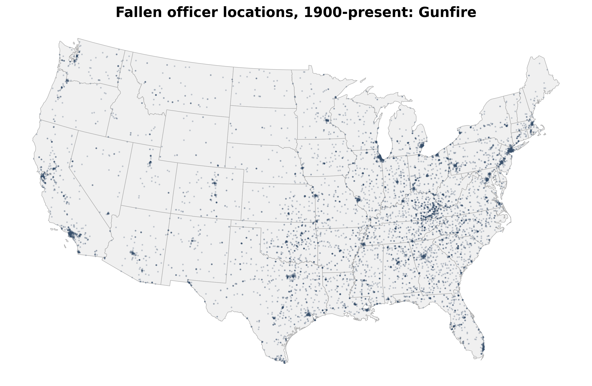

# End of Watch
Tracking cases of law enforcement officers killed in the line of duty. 



## About

This code in this repository collects, processes and stores information about more than 25,000 American peace officers killed in the line of duty. The data comes from the [Officer Down Memorial Page](https://www.odmp.org/info/about-odmp), a non-profit group that honors fallen law enforcement personnel.

## Process

### Scripts

Basic information about the officers is fetched from [annual collection pages](https://www.odmp.org/search/year/2024) on the group's website using Python, and then further details are extracted from each officer's memorial page, such as [this one](https://www.odmp.org//officer//15488-police-officer-aubrey-wright-hawkins). 

#### Historical data

- `fetch_officers_historical.py`: A one-off script that fetched fallen officer information from 1900-2023.

#### Current data

- `fetch_officers.py`: A script that fetches a list of officers and their detailed information from the current year and then combines it with the historical data, removing any duplicates, and storing a combined final archive.

Note: These two scripts try to split the combined title and name included for each officer by using a list of common law enforcement titles and a regular expression pattern. 

```python
# Read sample officer titles list to help split names/titles
with open("data/raw/titles.txt", "r") as file:
    titles = [line.strip() for line in file]

# Create a regex pattern to match the titles
pattern = r"\b(" + "|".join(titles) + r")\b"

# Extract the title using the pattern
df["title"] = df["name"].str.extract(pattern)

# Replace the title in the name with an empty string and strip any leading/trailing spaces
df["officer_name"] = df["name"].str.replace(pattern, "", regex=True).str.strip()
```

This process is imperfect, however, and needs adjustment so the resulting `title` and `officer_name` items are correct in all cases. *The original `name` field has been retained because of [this issue](https://github.com/stiles/police-end-of-watch/issues/1).*

#### Geographic data

- `process_officer_locations.py`: Creates a GeoDataFrame from an officer's locations using latitude and longitude coordinates provided by the source, adding a country name and ISO three-digit codes from reference files. It then plots several static maps facetting by the causes — gunfire, terrorist attacks and automobile crashes, among others — and stores them in the `visuals` directory. 

#### Coming soon

*Scripts for analyzing trends by year, additional geography questions, department, officer type (including canines) and causes of death will be added eventually. Please [get in touch](mailto:mattstiles@gmail.com) to suggest ideas.*

## Automation

The collection is kept current by adding new cases to a running archive with a Github Actions workflow: `.github/workflows/fetch_officers.yml`. 

It's timed to run automatically at 6:29 pm Central Time on Sundays in memory of the late [Aubrey Hawkins](https://www.odmp.org/officer/15488-police-officer-aubrey-wright-hawkins), a police officer in Irving, Texas, who was shot and killed on Christmas Eve in 2000 while responding to a robbery-in-progress call at a sporting goods store. I was a student in nearby Arlington, Texas, at the time. 

## Outputs

The data are stored on Amazon S3 in CSV, JSON and GeoJSON formats.

### Storage

#### Slain officers, current year
Formats: [CSV](https://stilesdata.com/police-end-of-watch/us_slain_police_officers_2024.csv) | [JSON](https://stilesdata.com/police-end-of-watch/us_slain_police_officers_2024.json)

#### Slain officers archive, 1900-present
Formats: [CSV](https://stilesdata.com/police-end-of-watch/us_slain_police_officers_archive_1900_present.csv) | [JSON](https://stilesdata.com/police-end-of-watch/us_slain_police_officers_archive_1900_present.json)

#### Slain officers geographic archive, 1900-present
Format: [GeoJSON](https://stilesdata.com/police-end-of-watch/us_slain_police_officers_archive_1900_present.geojson)

### JSON structure

The JSON file has a list of dictionaries. Each contains the following items: 

```json
    {
        "name":"Police Officer Aubrey Wright Hawkins",
        "officer_name":"Aubrey Wright Hawkins",
        "title":"Police",
        "department_name":"Irving Police Department",
        "state_abbreviation":"TX",
        "cause":"Gunfire",
        "date":"2000-12-24",
        "year":2000,
        "weekday":"Sunday",
        "canine":false,
        "url":"https:\/\/www.odmp.org\/officer\/15488-police-officer-aubrey-wright-hawkins",
        "photo_url":"15488\/125\/15488.jpg",
        "incident_description":"Police Officer Aubrey Hawkins was shot and killed after he and another officer responded to a robbery-in-progress at a local sporting goods store. \n\nOfficer Hawkins arrived at the store approximately three minutes after the call was made and interrupted the suspects, who were handcuffing and tying up the store employees. The suspects opened fire on Officer Hawkins, killing him. The seven suspects had escaped from a Texas prison two weeks prior to the incident when they stormed a guard tower and stole several weapons. Capital murder warrants were issued for all seven suspects.\n\nDuring the search for the suspects, Colorado State Trooper Jason Manspeaker was killed in an automobile crash while responding to investigate a sighting.\n\nApproximately one month after Officer Hawkins' murder, six of the suspects were apprehended, and the seventh committed suicide. All six suspects were convicted of Officer Hawkins' murder and sentenced to death. One was executed on August 14, 2008. The leader of the group was executed on February 29, 2012. A third suspect was executed on February 4, 2015, and a fourth was executed on December 6, 2018.\n\nOfficer Hawkins had served with the Irving Police Department for 15 months and previously served with the Kaufman Police Department and Tarrant County Hospital District Police Department for a total of 4 years. He is survived by his wife and son.\n\nAubrey Hawkins Lane in Irving was dedicated in his honor.",
        "age":"29",
        "tour":"5 years, 3 months",
        "badge":"830",
        "weapon":"Handgun",
        "offender":"Four executed",
        "lat":32.8342248,
        "lon":-96.9975519
    }
```

### GeoJSON structure

The GeoJSON file has additional items for the country and a point geometry with coordinates: 

```json
{
            "type": "Feature",
            "properties": {
                "name": "Police Officer Aubrey Wright Hawkins",
                "officer_name": "Aubrey Wright Hawkins",
                "title": "Police",
                "department_name": "Irving Police Department",
                "state_abbreviation": "TX",
                "cause": "Gunfire",
                "date": "2000-12-24",
                "year": 2000,
                "weekday": "Sunday",
                "canine": false,
                "url": "https://www.odmp.org/officer/15488-police-officer-aubrey-wright-hawkins",
                "photo_url": "15488/125/15488.jpg",
                "incident_description": "Police Officer Aubrey Hawkins was shot and killed after he and another officer responded to a robbery-in-progress at a local sporting goods store. \n\nOfficer Hawkins arrived at the store approximately three minutes after the call was made and interrupted the suspects, who were handcuffing and tying up the store employees. The suspects opened fire on Officer Hawkins, killing him. The seven suspects had escaped from a Texas prison two weeks prior to the incident when they stormed a guard tower and stole several weapons. Capital murder warrants were issued for all seven suspects.\n\nDuring the search for the suspects, Colorado State Trooper Jason Manspeaker was killed in an automobile crash while responding to investigate a sighting.\n\nApproximately one month after Officer Hawkins' murder, six of the suspects were apprehended, and the seventh committed suicide. All six suspects were convicted of Officer Hawkins' murder and sentenced to death. One was executed on August 14, 2008. The leader of the group was executed on February 29, 2012. A third suspect was executed on February 4, 2015, and a fourth was executed on December 6, 2018.\n\nOfficer Hawkins had served with the Irving Police Department for 15 months and previously served with the Kaufman Police Department and Tarrant County Hospital District Police Department for a total of 4 years. He is survived by his wife and son.\n\nAubrey Hawkins Lane in Irving was dedicated in his honor.",
                "age": "29",
                "tour": "5 years, 3 months",
                "badge": "830",
                "weapon": "Handgun",
                "offender": "Four executed",
                "lat": 32.8342248,
                "lon": -96.9975519,
                "index_right": 238,
                "ADMIN": "United States of America",
                "ISO_A3": "USA"
            },
            "geometry": {
                "type": "Point",
                "coordinates": [
                    -96.9975519,
                    32.8342248
                ]
            }
        }
```

## Usage

To set up the project and run the data collection scripts, follow these steps:

1. Clone the repository to your local machine.

2. Install the necessary Python packages using the `requirements.txt` file:
   ```bash
   pip install -r requirements.txt
   ```

3. Optional: To store data on S3, update `.github/workflows/fetch_officers.yml` with your path to S3: `s3://{YOUR_BUCKET_NAME}` and configure environment variables (passed in the workflow) in as Github secrets. S3 storage only happens when the workflow runs.
   - `AWS_ACCESS_KEY_ID`
   - `AWS_SECRET_ACCESS_KEY`

4. Execute scripts to fetch and process poll data and trend timeseries locally or by running the workflow:
   ```bash
   python fetch_officers.py
   ```

## Contributing

Please submit any issues or pull requests to contribute to this project.

## License

The code in this project is licensed under Creative Commons. See the [LICENSE](LICENSE) file for more details. Data usage subject to the ODMP's [terms](https://www.odmp.org/info/terms-of-use). 

## About 

The project, a work in progress, is a non-commercial exercise to analyze trends related to fallen officers and to demonstrate the process of building automated data pipelines. It is not affiliated with my employer.

## Contact 

Questions? [Holler](mailto:mattstiles@gmail.com)